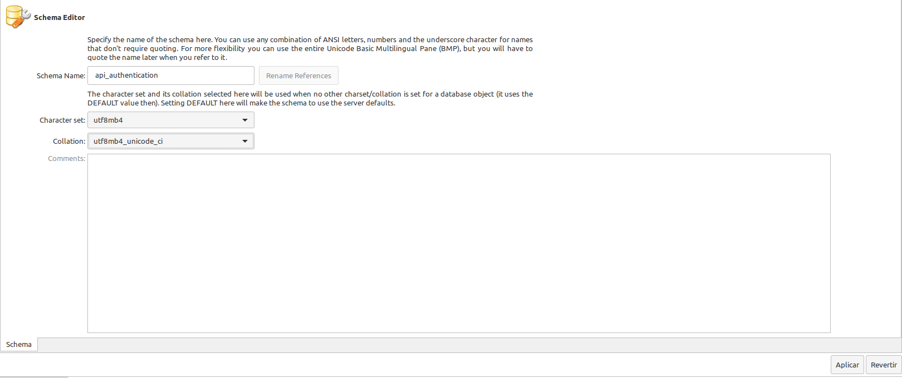

# Challenge PHP
A continuación se describe el desarrollo de un API REST con autenticación OAuth2.0, con una integración de la API de [GHIFY](https://developers.giphy.com/docs/api/#quick-start-guide).

## Instalaciones necesarias, previas a la creación del proyecto (se ha realizado en entorno Linux, distribución Mint).

### Para actualizar el índice de paquetes
```bash
sudo apt update
```

### Para instalar PHP y sus extensiones necesarias
```bash
sudo apt install php php-cli php-mbstring php-xml php-sip php-json php-mysql
```

### Para instalar Composer (Gestor de dependencias de PHP)
```bash
sudo install composer
```

## Creación del proyecto

### Se debe crear el directorio del proyecto
```bash
mkdir api-authentication
```

### Se accede a dicho directorio creado
```bash
cd api-authentication
```

### Se abre el proyecto para trabajar en él (se ha utilizado el editor Visual Studio Code)
```bash
code .
```

### Instalación de Laravel v10 (se debe tener instalado previamente Composer)
```bash
composer create-project laravel/laravel .
```

## Creación de la Base de Datos (se ha utilizado MySQL y MySQL Workbench)


## Modificar variables de entorno para la base de datos creada
### En el archivo .env, se deben definir los valores para el nombre de la base de datos, usuario y la contraseña
```bash
DB_DATABASE=api_authentication
DB_USERNAME=root
DB_PASSWORD=<su_password>
```

## Creación de las tablas iniciales, ejecutando las migraciones por defecto del proyecto
```bash
php artisan migrate
```

### Para la Autenticación OAuth2.0 se ha utilizado el paquete Passport de Laravel.
```bash
composer require laravel/passport
```

### Creación de las tablas que Passport necesita
```bash
php artisan migrate
```

### Crear las claves de cifrado necesarias para generar tokens de acceso (también crea clientes de "acceso personal" y "concesión de contraseña" que se utilizan para generar tokens de acceso).
```bash
php artisan passport::install
```

### Se debe editar la clase del modelo de User (app/Models/User.php)
Se debe reemplazar: use Laravel\Sanctum\HasApiTokens; por Laravel\Passport\HasApiTokens;

Se debe agregar el Trait HasApiTokens

### Editar el archivo config/auth.php (para definir la protección de autenticación de API y setear el driver para Passport)
```bash
'guards' => [
    'web' => [
        'driver' => 'session',
        'provider' => 'users',
    ],
    'api' => [
        'driver' => 'passport',
        'provider' => 'users',
    ]
],
```

### Crear un cliente para probar la funcionalidad OAuth2
```bash
php artisan passport:client
```

## El código del proyecto se encuentra en este repositorio, el cual contiene, además de la estructura de directorios de Laravel, el directorio documentos/, con:
- los diferentes diagramas (visualizados debajo).
- el archivo json con la colección Postman, y el script para almacenar en una variable de entorno, el valor del Token, habiendo ejecutado el endpoint de  Login

## Diagrama de Casos de Uso


## Diagrama de Secuencia - CU: Login


## Diagrama de Secuencia - CU: Buscar GIFs


## Diagrama de Secuencia - CU: Buscar GIF por ID


## Diagrama de Secuencia - CU: Guardar GIF Favorito


## Diagrama de Entidad Relación


## Colección de Postman.

- **Nombre**: API - Challenge
- **Descripción**: contiene servicios para:
- - Solicitar Login, se integra el script de automatización para que el valor del Token resultante, se almacene en el environment.
- - Buscar Gifs por texto (una frase o término).
- - Buscar un Gif por su ID ([el cual es un string](https://developers.giphy.com/docs/api/endpoint#get-gif-by-id)).
- - Guardar un Gif como favorito, para el usuario autenticado.
- Enlace para la descarga completa de la colección [aquí](documentos/api-challenge.postman_collection.json).


## Ejecución de pruebas (desde el raíz del proyecto).

### Para ejecutar todos los Tests Unitarios, se utiliza el siguiente comando:
```bash
php artisan test
```

### Para ejecutar los Tests Feature (de características), se utiliza el siguiente comando:
```bash
php artisan test --testsuite=Feature
```

### Para ejecutar un Test Unitario específico:
```bash
php artisan test tests/Unit/GifControllerTest.php
```

### Para ejecutar un Test Feature específico:
```bash
php artisan test tests/Feature/GifSearchTest.php


php artisan test tests/Feature/GifStoreTest.php
```

## Tecnologías aplicadas:
- PHP v8.3.3
- Laravel Framework v10
- MySQL
- UML

